# ServerScan

      


```shell
███████╗███████╗██████╗ ██╗   ██╗███████╗██████╗     ███████╗ ██████╗ █████╗ ███╗   ██╗
██╔════╝██╔════╝██╔══██╗██║   ██║██╔════╝██╔══██╗    ██╔════╝██╔════╝██╔══██╗████╗  ██║
███████╗█████╗  ██████╔╝██║   ██║█████╗  ██████╔╝    ███████╗██║     ███████║██╔██╗ ██║
╚════██║██╔══╝  ██╔══██╗╚██╗ ██╔╝██╔══╝  ██╔══██╗    ╚════██║██║     ██╔══██║██║╚██╗██║
███████║███████╗██║  ██║ ╚████╔╝ ███████╗██║  ██║    ███████║╚██████╗██║  ██║██║ ╚████║
╚══════╝╚══════╝╚═╝  ╚═╝  ╚═══╝  ╚══════╝╚═╝  ╚═╝    ╚══════╝ ╚═════╝╚═╝  ╚═╝╚═╝  ╚═══╝
                                                                                By:Trim   
```

一款使用**Golang**开发且适用于攻防演习**内网横向信息收集**的**高并发**网络扫描、服务探测工具。

## 🍭Property
- 多平台支持（Windows、Mac、Linux、Cobalt Strike）
- 存活IP探测（支持TCP、ICMP两种模式）
- 超快的端口扫描
- 服务和应用版本检测功能，内置指纹探针采用:[nmap-service-probes](https://raw.githubusercontent.com/nmap/nmap/master/nmap-service-probes)
- Web服务（http、https）信息探测
- ~~扫描结果兼容INFINITY攻防协同平台~~（暂不公开）

## 🎉First Game

​	总结诸多实战经验，考虑到实战过程中会出现和存在复杂的环境、红蓝对抗过程中常用的内存加载无文件落地执行等，因此**ServerScan**设计了**轻巧版**、**专业版**、支持**Cobalt Strike跨平台beacon:[Cross C2](https://github.com/gloxec/CrossC2)的动态链接库**，**~~以及支持INFINITY攻防协同平台的专用版~~**。便于在不同的Shell环境中可以轻松自如地使用：如：Windows Cmd、Linux Console、远控Console、WebShell等，以及Cobalt Strike联动使用cna脚本文件加载，实现内网信息快速收集，为下一步横向移动铺路。

**轻巧版：**

 参数形式简单、扫描速度快、耗时短、文件体积小、适合在网络情况较好的条件情况下使用。

**专业版：**

 支持参数默认值、支持自定义扫描超时时长、支持扫描结果导出、适合在网络条件较苛刻的情况下使用。

**动态链接库：**

 为支持Cobalt Strike跨平台beacon，无文件落地执行，无文件执行的进程信息，基于轻巧版本进行动态链接库编译，扫描超时时长为1.5秒。

### 💻for  Linux or Windows

  * #### 轻巧版
  
    * ***for PortScan***
    
      **Usage：**
    
      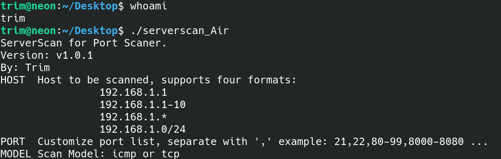
    
      **Scanning：**
    
      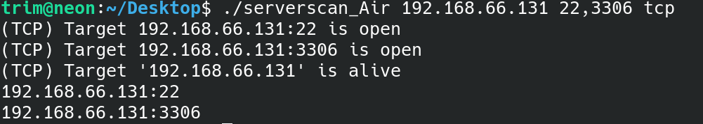
    
    * ***for Service and Version Detection***
    
      **Usage：**
    
      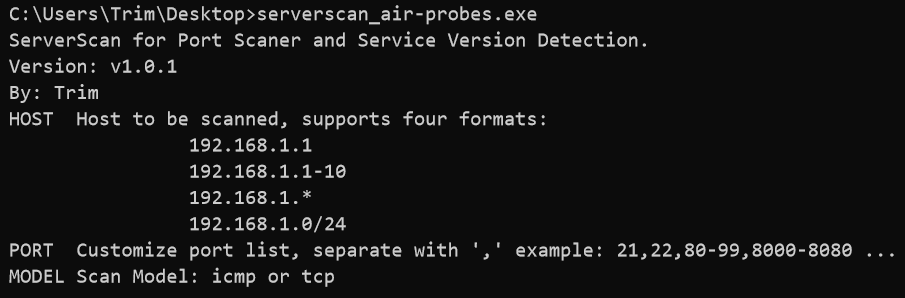
    
      **Scanning：**
    
      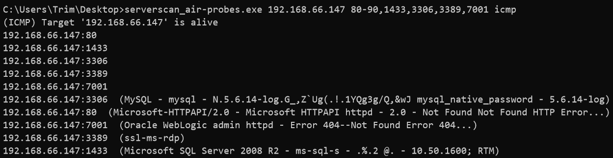
  
  * #### 专业版

    * ***for PortScan***

      **Usage：**

      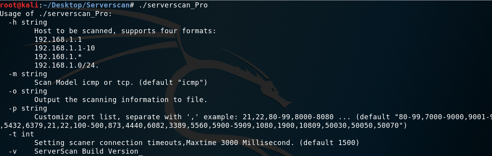

      **Scanning：**
    
      
    
    * ***for Service and Version Detection***
    
      **Usage：**
    
      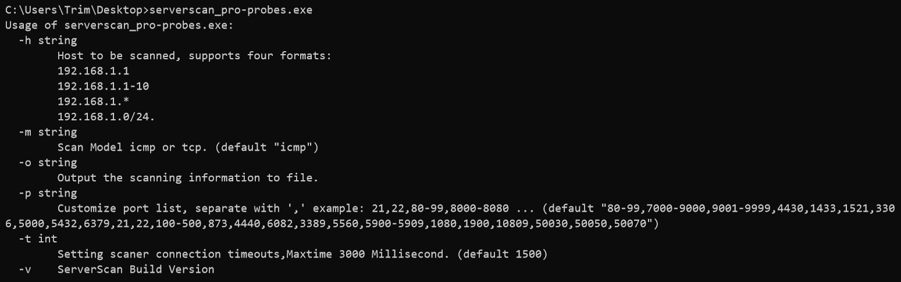
    
      **Scanning：**
    
      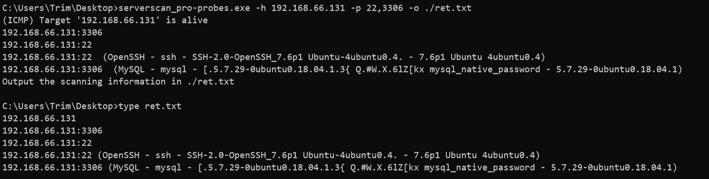

 

### 🎮for Cobalt Strike

  * ***Windows***

       	由于Cobalt Strike已经内置了PortScan，因此目前Windows仅支持利用cna上传对应版本的ServerScan可执行文件到服务器进行扫描。

      * ***for Service and Version Detection***

        Interact:

        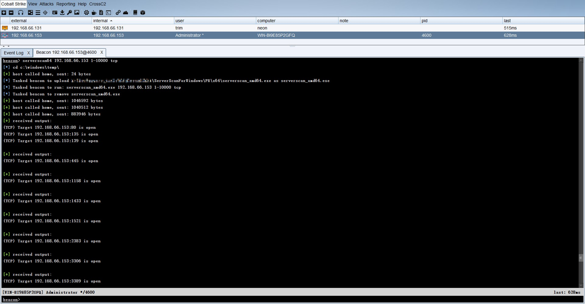

        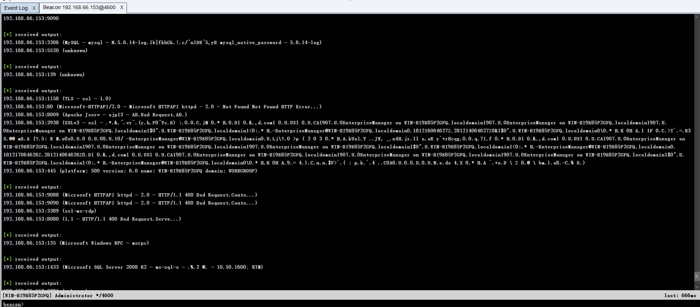


  * ***Cobalt Strike跨平台beacon***

    ​        ServerScan的优势在于跨平台，在Hook师傅的帮（jiān）助（dū）下目前已经基本适配了[Cross C2](https://github.com/gloxec/CrossC2)的Linux、Mac OS两大平台，为了提高隐匿性减少文件特征，目前支持内存加载可执行程序和动态链接库调用，您只需在安装了Cross C2的Cobalt Strike中导入对应的.cna脚本，即可实现ServerScan与Cobalt Strike跨平台beacon联动，具体使用参考[Usage](#usage)。

      * ***for PortScan***

        Interact:

        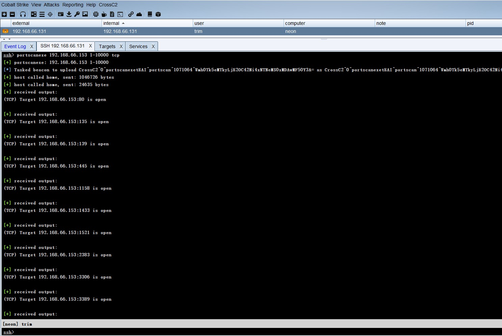

        Targets结果集自动导入:

        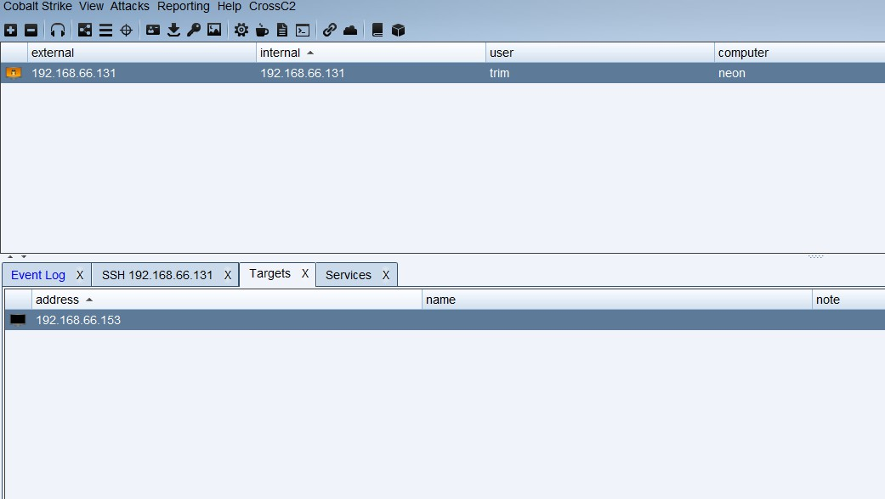

        services结果集自动导入:

        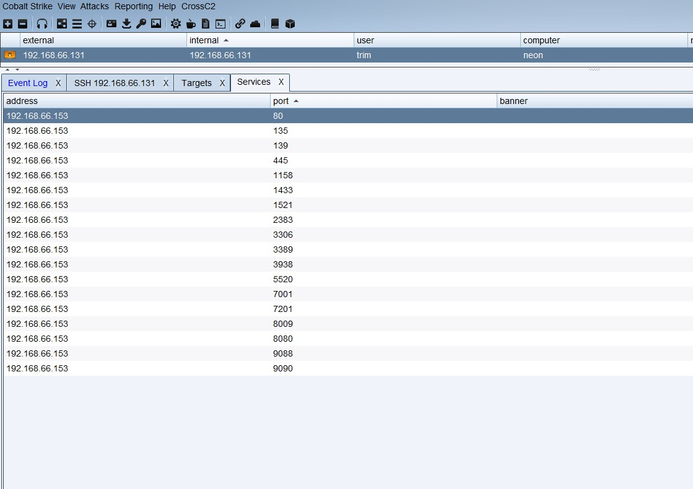

      * ***for Service and Version Detection***

        Interact:

        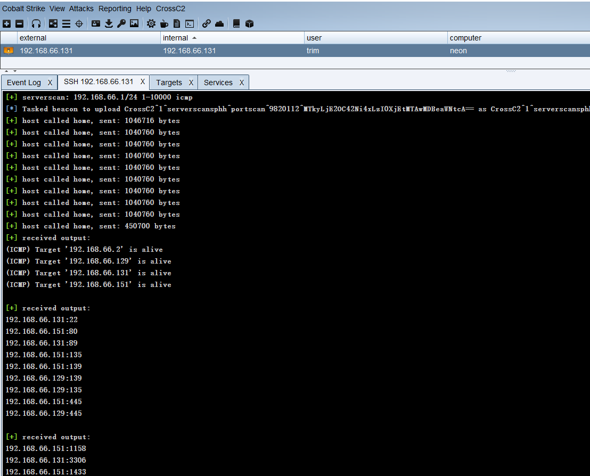

        Targets结果集自动导入:

        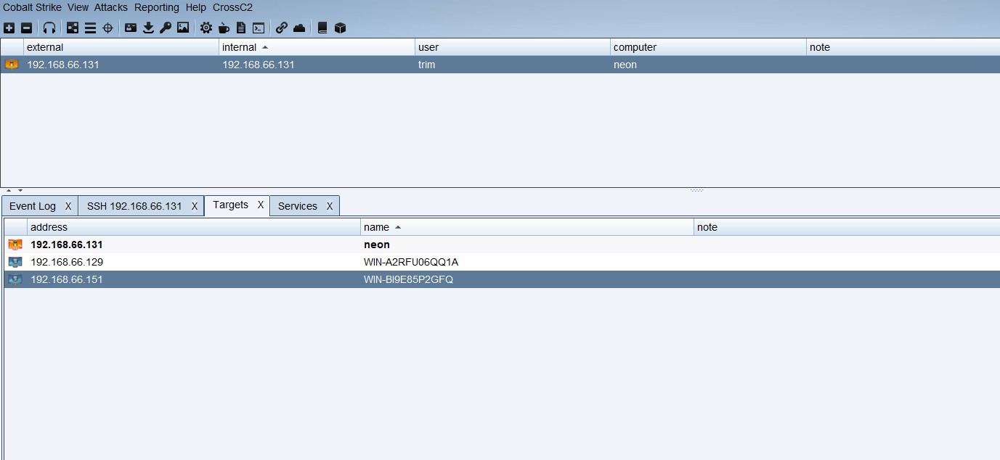

        services结果集自动导入:

        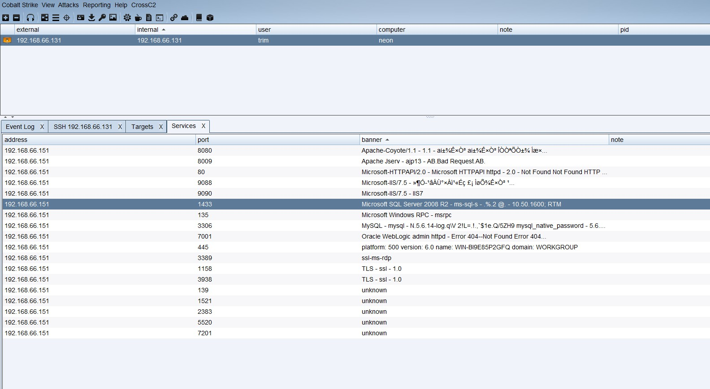


## 🌈Runtime Environment

为了实现“**一次开发，到处运行**”的效果，**ServerScan**采用具有跨平台编译特性的**Golang**进行开发。

目前已成功编译了**三大主流操作系统**的**可执行程序**和**动态链接库**，并在如下操作系统**通过**了运行测试：

#### 📺Windows

- **Windows 2003**
  - [x] **x86**

- **Windows 2008 server 、Windows 2012  server 、Windows 7 、Windows  10**
  - [x] **x86**
  - [x] **x64**
  - [x] **.dll**

#### 🐧Linux
- **Ubuntu 、Centos、Kali**
  - [x] **x86**
  - [x] **x64**
  - [x] **.so**

#### 🍎Mac OS
  - [x] **x64**
  - [x] **.dylib**


## 🐱‍👓Usage

* **轻巧版**

  ```shell
  HOST  Host to be scanned, supports four formats:
      192.168.1.1
      192.168.1.1-10
      192.168.1.*
      192.168.1.0/24
  PORT  Customize port list, separate with ',' example: 21,22,80-99,8000-8080 ...
  MODEL Scan Model: icmp or tcp
  ```

* **专业版**

    ```shell
      -h string
        	Host to be scanned, supports four formats:
        	192.168.1.1
        	192.168.1.1-10
        	192.168.1.*
        	192.168.1.0/24.
      -m string
        	Scan Model icmp or tcp. (default "icmp")
      -o string
        	Output the scanning information to file.
      -p string
        	Customize port list, separate with ',' example: 21,22,80-99,8000-8080 ... (default "80-99,7000-9000,9001-9999,4430,1433,1521,3306,5000,5432,6379,21,22,100-500,873,4440,6082,3389,5560,5900-5909,1080,1900,10809,50030,50050,50070")
      -t int
        	Setting scaner connection timeouts,Maxtime 30 Second. (default 2)
      -v	ServerScan Build Version
    ```

* **Cobalt Strike版本**

  ```shell
  ├─ServerScanForLinux
  │  │  CrossC2Kit.cna
  │  │  serverscan.linux.elf.cna
  │  │  serverscan.linux.so.cna
  │  │
  │  ├─ELF
  │  │      portscan
  │  │      portscan386
  │  │      serverscan
  │  │      serverscan386
  │  │
  │  └─SO
  │          crossc2_portscan.so
  │          crossc2_serverscan.so
  │
  └─ServerScanForWindows
      │  serverScan.win.cna
      │
      └─PE
          ├─x64
          │      serverscan_amd64.exe
          │
          └─x86
                  serverscan_386.exe
  ```

  * ***Windows***

   	在Cobalt Strike的Script Manager中***Load*** serverScan.win.cna

  （Ps：serverScan.win.cna主要是通过将本地对应版本的Serverscan上传到服务器的c:\\windows\\temp\目录执行，此方法略显笨拙，后期会更新无文件落地的方法）

  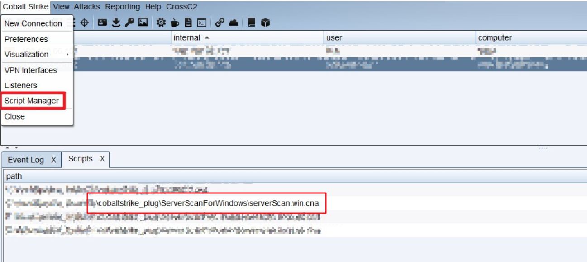

   	 选择一个已经上线的beacon,在Interact中输入help查看Commands是否新增了Serverscan86、Serverscan64，若出现就可以像使用portscan一样使用serverscan了🙂

  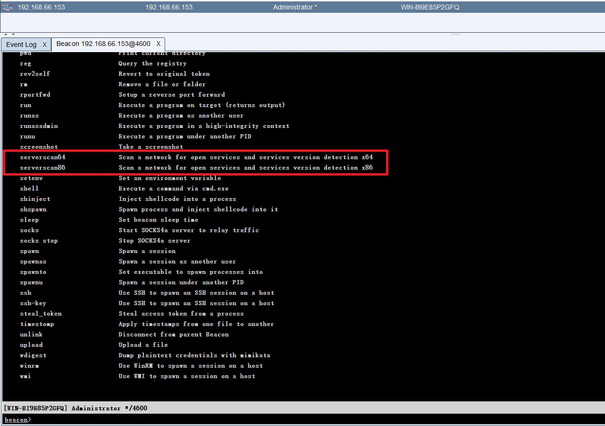

  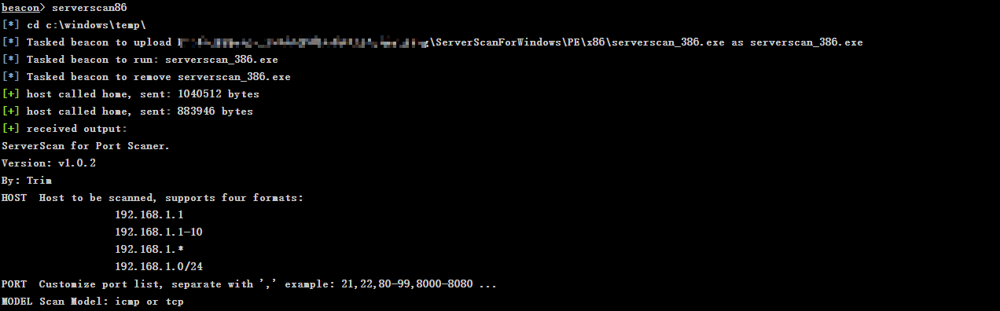

  * ***Cobalt Strike跨平台beacon***

  ​     首先您应该确保已经在Cobalt Strike成功安装了[Cross C2](https://github.com/gloxec/CrossC2)；

  ​	其次在Cobalt Strike的Script Manager中 ***Load*** serverscan.linux.elf.cna 和  serverscan.linux.so.cna两个脚本，其分别对应内存加载ELF、动态链接库so调用，两者的区别主要是隐匿性的问题😎

  ​	若直接调用so文件运行serverscan时，在主机上ps无法找到对应的进程，而直接内存加载serverscan的ELF则会在运行过程中出现一个随机名称的扫描进程🙃

  （目前带有指纹识别的动态链接库编译的文件体积较大，还没有找到合适的办法压缩体积，各位师傅们有好的提议欢迎issue）🔥🔥🔥

  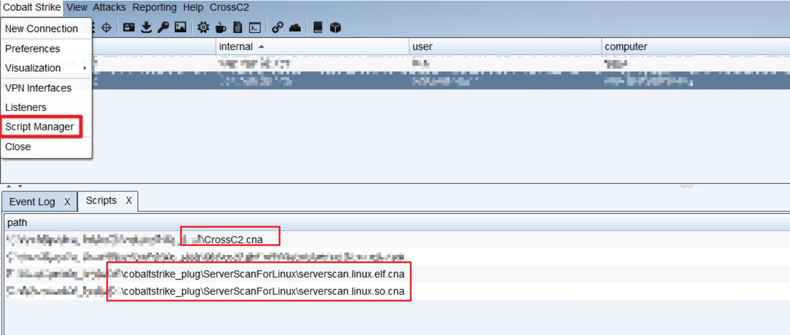

​		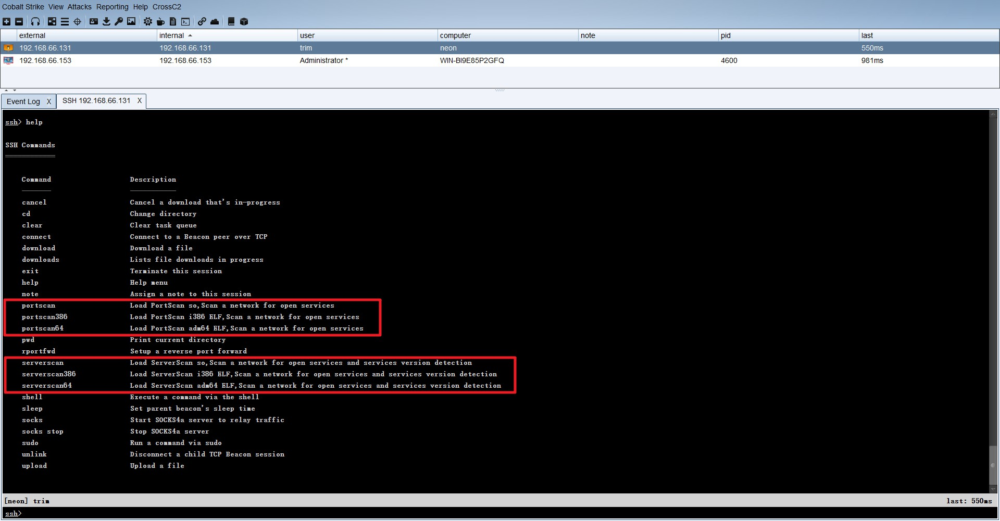

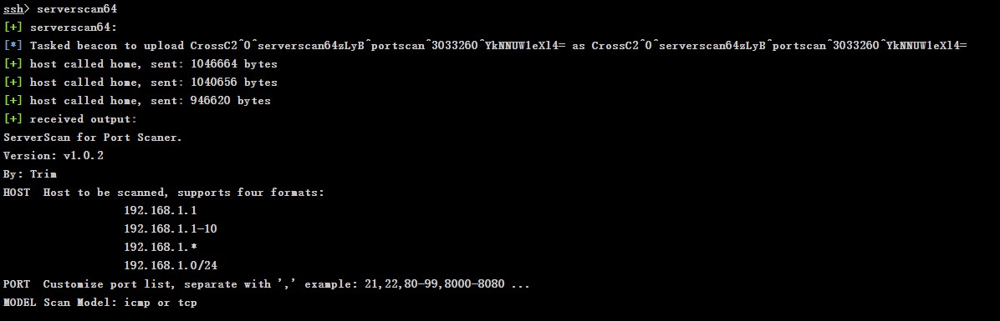

* **INFINITY攻防协同平台版本**

   ~~（暂不公开）~~


## 🎁支持ServerScan

如果您认为ServerScan帮助到了您，可使用微信扫一扫下方的**赞赏码**，支持作者继续**改进**和**优化**ServerScan。


## 🧐问题反馈

> 💌：trim@venomsec.org


## 💖鸣谢

一路走来，得到了很多前辈的帮助和指导，在此表示衷心的感谢！

下列是本项目使用或者参考的优秀开源框架，感谢网上众多的开源项目及其开源项目的作者，致敬为网络安全事业做出贡献的每一位前辈！

* [httpscan](https://github.com/soxfmr/httpscan.go) - httpscan implements by Go
* [iprange](https://github.com/malfunkt/iprange) - IPv4 address parser for the nmap format
* [lanscan](https://github.com/stefanwichmann/lanscan) - Blazing fast, local network scanning in Go
* [vscan-go](https://github.com/RickGray/vscan-go) - Golang version for nmap service and application version detection

## 📄版权

 该项目签署了GPL-3.0授权许可，详情请参阅[Licence](https://github.com/Adminisme/ServerScan/Licence)

 除此之外也需要遵守项目中如下的补充条款：

 该项目未经作者本人允许，禁止商业使用。

 任何人不得将其用于非法用途及盈利等目的，否则自行承担后果并负相应法律责任。

## 📜免责声明

1. 本工具仅面向拥有合法授权的渗透测试安全人员及进行常规操作的网络运维人员，用户可在取得足够合法授权且非商用的前提下进行下载、复制、传播或使用。
2. 在使用本工具的过程中，您应确保自己的所有行为符合当地法律法规，且不得将此软件用于违反中国人民共和国相关法律的活动。本工具所有作者和贡献者不承担用户擅自使用本工具从事任何违法活动所产生的任何责任。

请您在下载并使用本工具前，充分阅读、完全理解并接受本协议的所有条款。您的使用行为或您以其他任何方式明示或默认表示接受本协议，即视为您已阅读并同意本协议的约束。
